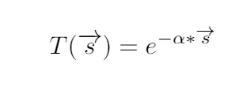

# D-PandiSIM : Distributed Pandemics Simulator 

**author : MOHAMED HMINI**<br>
**status : ( debugging phase )**

## I. Introduction : 

the main goal of d-pandisim is to generate pandemics data using big-data technologies, so in essence d-pandisim is a package built on top of pyspark since the code is written in python, as we well know the contact-tracing data with the growth of privacy concerns is usually not accessible or stored in the first place, the thing which makes it harder and unconceivable to make good modeling of the state of the world pandemics, fortunately we have computers and by the help of distributed systems we can more or less execute complex iterative methods to simulate the spread of these illness with a good degree of accuracy depending on the used sub-models.

to generate this data we would need four main components to be plugged into the PandiSim module : 

1. the initializer : which initializes the network.
2. the epidemic model : which predicts state of the world in each iteration.
3. the node scoring model : which scores each node in the network and subsequently annotate them based on the epidemic model predictions.
4. the edge estimation model : which draws new edges between the nodes.
  
these four subcomponents can be anything as long as they can be executed in harmoney with each other beneath the PandiSim object methods, the package comes with one example for each component with full implementation, which shall be discussed later.

## II. Environment : 

the project is achieved using docker containers, we use bde2020 hadoop images as well as the jupyter/pyspark-notebook which can be both found in the docker compose file in [docker-compose.yml](./docker-compose.yml), the user may re-configure the containers to adapt the environment to his planned project.

before running the application one should make sure that the memory management configurations are suitable for the work to be done, specifying the number of partitions as well as the memory fraction is crucial for better performance, an example is given below, in the real world we would want to run the application in a distributed environment and not in a local machine.

```python
spark = SparkSession.builder.master('local')\
    .config(key = "spark.default.parallelism", value = 4)\
    .config(key = "spark.driver.memory", value = "4g")\
    .config(key = "spark.executor.memory", value = "4g")\
    .config(key = "spark.memory.fraction", value = "0.8")\
    .getOrCreate()
```

## III. Initializer : 

the initializer used in our example is a simple one which depends on parameters such as the number of infected/recovered people as an initial state, the simple initializer is found in [Initializer101.py](./initializers/Initializer101.py).

## IV. Epidemic Model : 

we may use complicated and very sophisticated Epidemic models to avoid generalization and capture the target epidemic (e.g: like the COVID19 pandemic), but in our example we use a simple SIR model developed by **Dr. Ronald Ross**, [Simple_SIR.py](./epi_models/Simple_SIR.py).

## V. Scoring Model : 

this model is very essential and can necessitates heavy computation, in our example we developed our own version of the pagerank algorithm making it more suitable for such a task, the main idea is to walk the network randomly for a finite number of iterations to deduce the probabilities of transition from one node to another based on the initial edges probabilities (hence the use of the markov chain).

to boil it down to simple terms, and since we want to score the nodes based on the previous scores, we will let the flow of importance go from the highly scored to the least scored nodes, in other words, nodes who have connections with highly scored nodes (probably infected) will get a score increase in the next iteration, conversely nodes with connections with least scored nodes (probably not infected) will get a decrease or a slight increase to their scores in the next itaration.

to avoid the problem of self-loops we create artifical edges between the self-loop node and the rest of the network to enable the spread of importance of that node and thus to solve the issue of a deadend.

the notebook explaining the Scoring Walker model can be found in [here](explaining_the_scoring_walker_model.ipynb)

let's start by formulating our model, the starting point is always the current nodes scores vector : 
<p align="center">
  
</p>
and since our goal is to build a stochastic matrix to be used in the markov chain and then to rescore the nodes we will need to use a probability distribution so that the outgoing nodes' values sum to one, for this sake we chose to use the **softmax** probability distribution.
<p align="center">
  
</p>
this is tedious to do be calculated for each node, so we are going to represent the whole procedure in terms of matrix operations, first we should already have the incidence matrix **A** which contains the real edges as well as the artificial edges (to avoid deadends / to consider self-loops), then we can calculate the matrix **M** which contains for each row (node outgoing links) the current node's transformed score.
<p align="center">
  
</p>
<p align="center">
  
</p>
<p align="center">
  
</p>
<p align="center">
  
</p>
then to calculate the second part of the softmax (the fractions) we just sum up each nodes out going links scaled values then we calculate the matrix **C** by performing an outerproduct to facilitate the element-wise multiplicaiton later.
<p align="center">
  
</p>
the final step in constructing the stochastic matrix **P** is by performing the element-wise multiplication.
<p align="center">
  
</p>
after acquiring the stochastic matrix now we can use the markov chain property of stationary processes and perform a finite set of transformations to find the ranking vector **r**.
<p align="center">
  
</p>
this vector stores important information about the nodes, it can tell us by how much we should increase the score of each node in the network.
<p align="center">
  
</p>
now that we have seen the math behind the implemented scoring walker, we might need to have a look at an actual conceret example, let's consider a network of only 5 nodes with arbitrary links, as we can see, we have 2 infected nodes (1 and 2) two least scored nodes (3 and 5), node 4 has a pretty high score as well, what we should pay attention too is that node 5 has no connections and thus can cause problems in the learning procedure.
<p align="center">
  
</p>
the modified graph is given below, the edges are three types : 
1. real edges denoted by the black color.
2. artificial edges denoted by the blue color and they are created to avoid deadends.
3. self-loops are a kind of artificial edges since we can say person "a" had contact with person "a".
<p align="center">
  
</p>
if we plot the ranks acquired from the markov chain we get the plot below, which clearly shows that we should inrease the score of node 3 more than any node and then 4 and 1 and 2 leaving node 5 to be the least increased which makes since since node 5 had no contact with any of the infected nodes while node 3 has two contacts with infected nodes.
<p align="center">
  
</p>
the generated new scores can now be considered instead of the old ones, we keep performing this computations iteratively until a stopping condition is met.
<p align="center">
  
</p>

## VI. Edge Estimation Model : 

the last but not least model is the edge estimator which can be used to draw new edges between different nodes in each iteration, the example we used is very simple which doesn't incoporate information from the existint network but instead it only relies on a **bernoulli** distribution with a **beta** prior.

